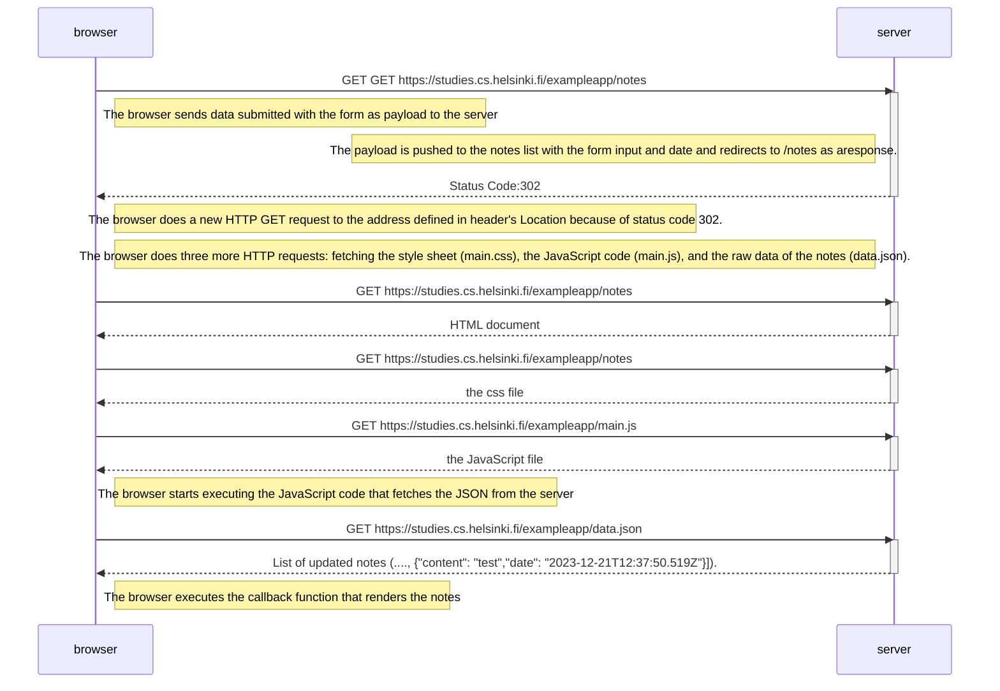

```mermaid
sequenceDiagram
    participant browser
    participant server

    browser->>server: GET GET https://studies.cs.helsinki.fi/exampleapp/notes
    activate server
    Note right of browser: The browser sends data submitted with the form as payload to the server
    Note left of server: The payload is pushed to the notes list with the form input and date and redirects to /notes as aresponse.
    server-->>browser: Status Code:302
    deactivate server

    Note right of browser: The browser does a new HTTP GET request to the address defined in header's Location because of status code 302.
    Note right of browser: The browser does three more HTTP requests: fetching the style sheet (main.css), the JavaScript code (main.js), and the raw data of the notes (data.json).

    browser->>server: GET https://studies.cs.helsinki.fi/exampleapp/notes
    activate server
    server-->>browser: HTML document
    deactivate server

    browser->>server: GET https://studies.cs.helsinki.fi/exampleapp/notes
    activate server
    server-->>browser: the css file
    deactivate server

    browser->>server: GET https://studies.cs.helsinki.fi/exampleapp/main.js
    activate server
    server-->>browser: the JavaScript file
    deactivate server

    Note right of browser: The browser starts executing the JavaScript code that fetches the JSON from the server

    browser->>server: GET https://studies.cs.helsinki.fi/exampleapp/data.json
    activate server
    server-->>browser: List of updated notes (...., {"content": "test","date": "2023-12-21T12:37:50.519Z"}]).
    deactivate server

    Note right of browser: The browser executes the callback function that renders the notes

```
