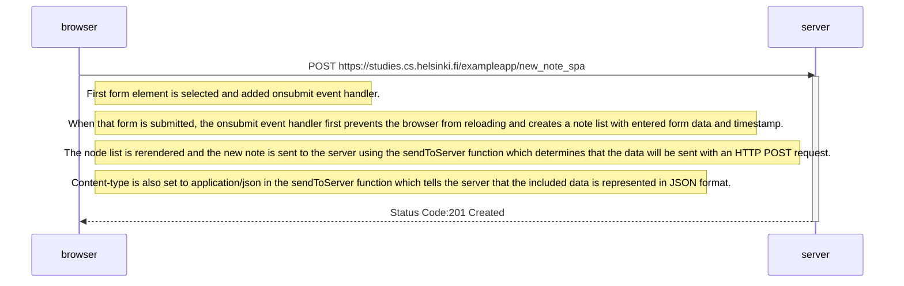

```mermaid
sequenceDiagram
    participant browser
    participant server

    browser->>server: POST https://studies.cs.helsinki.fi/exampleapp/new_note_spa
    activate server
    Note right of browser: First form element is selected and added onsubmit event handler.
    Note right of browser: When that form is submitted, the onsubmit event handler first prevents the browser from reloading and creates a note list with entered form data and timestamp.
    Note right of browser: The node list is rerendered and the new note is sent to the server using the sendToServer function which determines that the data will be sent with an HTTP POST request.
    Note right of browser: Content-type is also set to application/json in the sendToServer function which tells the server that the included data is represented in JSON format.

    server-->>browser: Status Code:201 Created
    deactivate server


```
