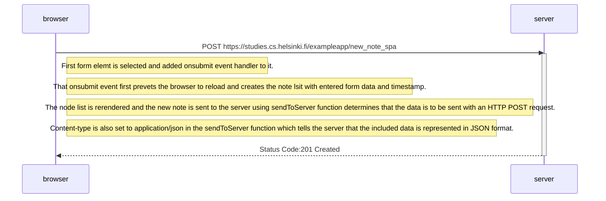

```mermaid
sequenceDiagram
    participant browser
    participant server

    browser->>server: POST https://studies.cs.helsinki.fi/exampleapp/new_note_spa
    activate server
    Note right of browser: First form elemt is selected and added onsubmit event handler to it.
    Note right of browser: That onsubmit event first prevets the browser to reload and creates the note lsit with entered form data and timestamp.
    Note right of browser: The node list is rerendered and the new note is sent to the server using sendToServer function determines that the data is to be sent with an HTTP POST request.
    Note right of browser: Content-type is also set to application/json in the sendToServer function which tells the server that the included data is represented in JSON format.

    server-->>browser: Status Code:201 Created
    deactivate server


```
